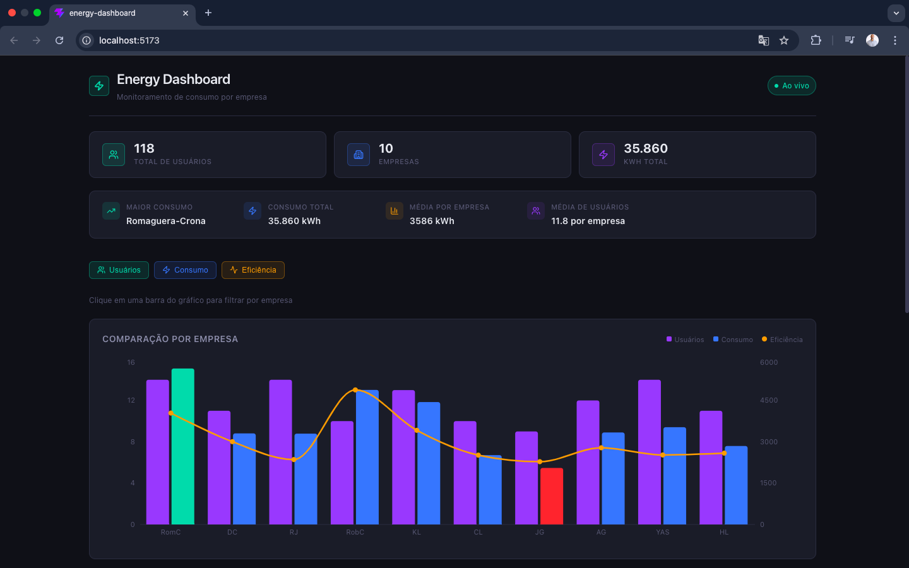
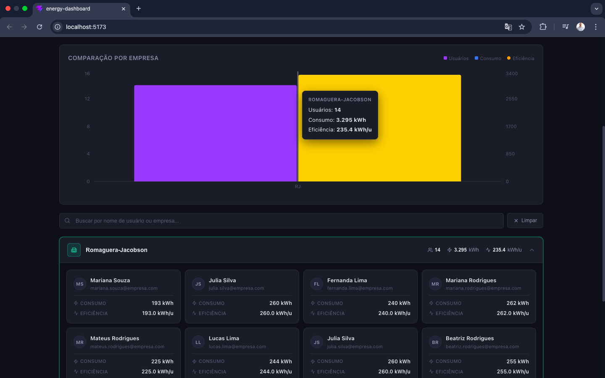
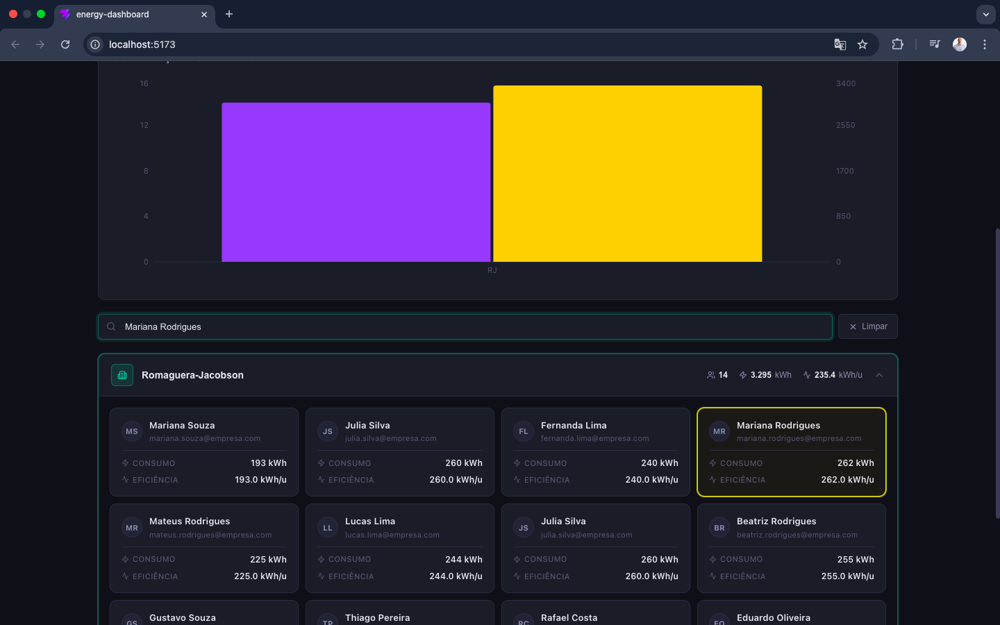

# ⚡ Energy Analytics Dashboard

Dashboard interativo para análise de consumo energético por empresa, com visualização em tempo real, filtros inteligentes e arquitetura fullstack (**React + Node.js**).

---

## Live Demo

🔗 (https://energy-dashboard-nine-gamma.vercel.app/)
🔗 (https://energy-dashboard-mod3.onrender.com/)

---

## Preview





---

## Sobre o projeto

O **Energy Analytics Dashboard** permite visualizar e comparar o consumo de energia entre diferentes empresas, com dados agregados e individuais por usuário.

A aplicação foi projetada para simular um cenário real de monitoramento energético, com foco em **performance, consistência de dados e experiência do usuário**.

---

## Funcionalidades

* Gráfico composto (Bar + Line) com:

  * Usuários por empresa
  * Consumo total
  * Eficiência energética

* Toggle de métricas (liga/desliga séries do gráfico)
* Busca com debounce por usuário ou empresa
* Filtro por empresa via clique direto no gráfico
* Accordion de usuários agrupados por empresa
* Highlight automático e sincronização entre gráfico e lista
* Siglas inteligentes no eixo X (evita colisões de nomes)
* Loading skeleton animado

---

## Diferenciais Técnicos

* **Dados determinísticos (seed)** → consistência entre execuções
* **Cache em memória no backend** → evita recomputação
* **Fonte única de verdade (single source of truth)** para o gráfico
* **Sincronização entre estados (gráfico ↔ lista)**
* **Debounce na busca** → melhor performance
* **Sanitização de dados** → evita quebras no gráfico
* **Renderização otimizada com useMemo**

---

## Tecnologias

### Frontend

* React 18 (Hooks)
* Vite
* Recharts (ComposedChart)
* Framer Motion (animações)
* Lucide React (ícones)

### Backend

* Node.js
* Express
* Seedrandom (dados determinísticos)
* Cache em memória

---

## Arquitetura

```txt
Frontend (React)
   ↓
API REST (Node + Express)
   ↓
Geração determinística de dados (seed)
```

---

## Estrutura do projeto

```
energy-dashboard/
├── backend/
│   └── server.js
├── frontend/
│   ├── src/
│   │   ├── components/
│   │   ├── hooks/
│   │   ├── features/
│   │   └── App.jsx
│   └── vite.config.js
├── .env.example
└── README.md
```

---

## ▶ Como rodar localmente

### Pré-requisitos

* Node.js 18+

---

### 1. Clone o repositório

```bash
git clone https://github.com/percilianocaio-jpg/energy-dashboard.git
cd energy-dashboard
```

---

### 2. Backend

```bash
cd backend
npm install
node server.js
```

---

### 3. Frontend

```bash
cd frontend
npm install
npm run dev
```

---

Acesse: http://localhost:5173

---

## API

| Método | Rota        | Descrição                  |
| ------ | ----------- | -------------------------- |
| GET    | `/users`    | Lista usuários com consumo |
| GET    | `/insights` | Métricas agregadas         |
| POST   | `/reset`    | Regenera os dados          |

---

## Deploy

### Frontend (Vercel)

```txt
Build: npm run build
Output: dist
Env: VITE_API_URL=https://sua-api.onrender.com
```

---

### Backend (Render)

```txt
Start: node server.js
```

---

## Autor

**Caio Perciliano**

🔗 GitHub:[(https://github.com/percilianocaio-jpg)]
🔗 Email: percilianocaio@gmail.com

---

## Observações

Este projeto foi desenvolvido com foco em portfólio, simulando um cenário real de dashboard analítico com dados dinâmicos e arquitetura fullstack.
# energy-dashboard
